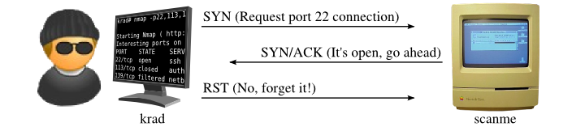

#  0. Will arp be enough ? 

Write a bash script that scan a subnetwork to discover live host using ARP scan.

- You should use nmap.
- Your code should tell nmap not to do a port scan after host discovery.
- You should run your code as privileged user. root or sudoers.
- Your script should accept a subnetwork as an arguments $1.

Depending on the scanned subnetwork, the output could change.
We can’t expect to learn about the Target MAC Address, unless we are in the the same subnetwork.
```
┌──(yosri)-[~/0x04_nmap_live_hosts_discovery]
└─🏴 ./0-arp_scan.sh 192.168.65.0/24
[sudo] password for yosri:
Starting Nmap 7.93 ( https://nmap.org ) at 2023-05-22 05:02 CDT
Nmap scan report for 192.168.65.1
Host is up (0.00064s latency).
MAC Address: C6:91:0C:4B:4E:64 (Unknown)
Nmap scan report for 192.168.65.2
Host is up.
Nmap done: 256 IP addresses (2 hosts up) scanned in 2.03 seconds
```

---

#  1. Host, do you hear me ? 

Write a bash script that scan a subnetwork to discover live host using ICMP Echo scan.

- You should use nmap.
- Your code should tell nmap not to do a port scan after host discovery.
- You should run your code as privileged user. root or sudoers.
- Your script should accept a subnetwork as an arguments $1.

Depending on the scanned subnetwork, the output could change.
```
┌──(yosri)-[~/0x04_nmap_live_hosts_discovery]
└─🏴 ./1-icmp_echo_scan.sh 6.19.100.0/24
[sudo] password for yosri:
Starting Nmap 7.93 ( https://nmap.org ) at 2023-05-21 14:02 CDT
Nmap scan report for 6.19.100.2
Host is up (0.14s latency).
Nmap done: 256 IP addresses (1 host up) scanned in 19.03 seconds
```
---

#  2. Time always matter 

Write a bash script that scan a subnetwork to discover live host using ICMP Timestamp scan.

- You should use nmap.
- Your code should tell nmap not to do a port scan after host discovery.
- You should run your code as privileged user. root or sudoers.
- Your script should accept a subnetwork as an arguments $1.

Depending on the scanned subnetwork, the output could change.
```
┌──(yosri)-[~/0x04_nmap_live_hosts_discovery]
└─🏴 ./2-icmp_timestamp_scan.sh 6.19.100.0/24
[sudo] password for yosri:
Starting Nmap 7.93 ( https://nmap.org ) at 2023-05-21 14:17 CDT
Nmap scan report for 6.19.100.2
Host is up (0.16s latency).
Nmap done: 256 IP addresses (1 host up) scanned in 19.93 seconds
```
---

#  3. Sometimes we need Masks ! 

Write a bash script that scan a subnetwork to discover live host using ICMP Address Mask scan.

- You should use nmap.
- Your code should tell nmap not to do a port scan after host discovery.
- You should run your code as privileged user. root or sudoers.
- Your script should accept a subnetwork as an arguments $1.

Depending on the scanned subnetwork, the output could change.
```
┌──(yosri)-[~/0x04_nmap_live_hosts_discovery]
└─🏴 ./3-icmp_address_mask_scan.sh 6.19.100.0/24
[sudo] password for yosri
Starting Nmap 7.93 ( https://nmap.org ) at 2023-05-10 15:15 CDT
Nmap done: 254 IP address (0 hosts up) scanned in 53.01 seconds
```
---

#  4. SYN Scan me 



Write a bash script that scan a subnetwork to discover live host using TCP SYN Ping scan.

- You should use nmap.
- Your code should tell nmap not to do a port scan after host discovery.
- Your code should scan for those ports22,80,443.
- Your script should accept a subnetwork as an arguments $1.

Depending on the scanned subnetwork, the output could change.
```
┌──(yosri)-[~/0x04_nmap_live_hosts_discovery]
└─🏴 ./4-tcp_syn_ping.sh 6.19.100.0/24
Starting Nmap 7.93 ( https://nmap.org ) at 2023-05-21 14:40 CDT
Nmap scan report for 6.19.100.2
Host is up (0.12s latency).
Nmap done: 256 IP addresses (1 host up) scanned in 22.42 seconds
```
---

# 5. Are your privileged enough to scan me ? 

Write a bash script that scan a subnetwork to discover live host using *TCP ACK Ping * scan.

- You should use nmap.
- Your code should tell nmap not to do a port scan after host discovery.
- Your code should scan for those ports 22,80,443.
- You should run your code as privileged user. root or sudoers.
- Your script should accept a subnetwork as an arguments $1.

Depending on the scanned subnetwork, the output could change. Unprivileged users have no choice but to complete the 3-way handshake if the port is open.
```
┌──(yosri)-[~/0x04_nmap_live_hosts_discovery]
└─🏴 ./5-tcp_ack_ping.sh 6.19.100.0/24
[sudo] password for yosri:
Starting Nmap 7.93 ( https://nmap.org ) at 2023-05-10 15:15 CDT
Nmap done: 256 IP addresses (0 hosts up) scanned in 154.50 seconds
```
---

#  6. UDP is our last hope 

Write a bash script that scan a subnetwork to discover live host using UDP Ping scan.

- You should use nmap.
- Your code should tell nmap not to do a port scan after host discovery.
- Your code should scan for those ports 53,161,162.
- You should run your code as privileged user. root or sudoers.
- Your script should accept a subnetwork as an arguments $1.

```
┌──(yosri)-[~/0x04_nmap_live_hosts_discovery]
└─🏴 ./6-udp_ping_scan.sh 6.19.100.0/24
[sudo] password for yosri:
Starting Nmap 7.93 ( https://nmap.org ) at 2023-05-21 15:10 CDT
Nmap scan report for 6.19.100.2
Host is up (0.13s latency).
Nmap done: 256 IP addresses (1 host up) scanned in 23.39 seconds
```
---

#  7. Simple Catch, is it mimicked ? 

Time To Ping The Target (cybernetsec0x04)

Catch the flag time is on, here is some tips:

- You should run your scan as privileged user. root or sudoers.
- The Current Flag is hidden within UDP opened port service VERSION
- Two hundred, Three hundred but no more. -p200-300

