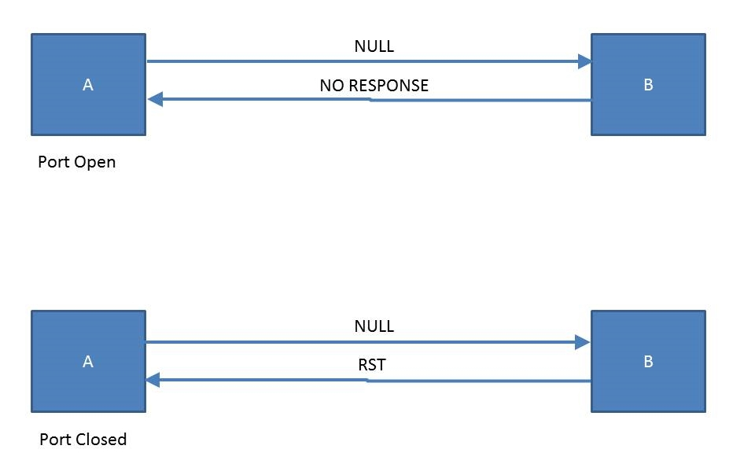
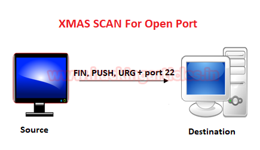
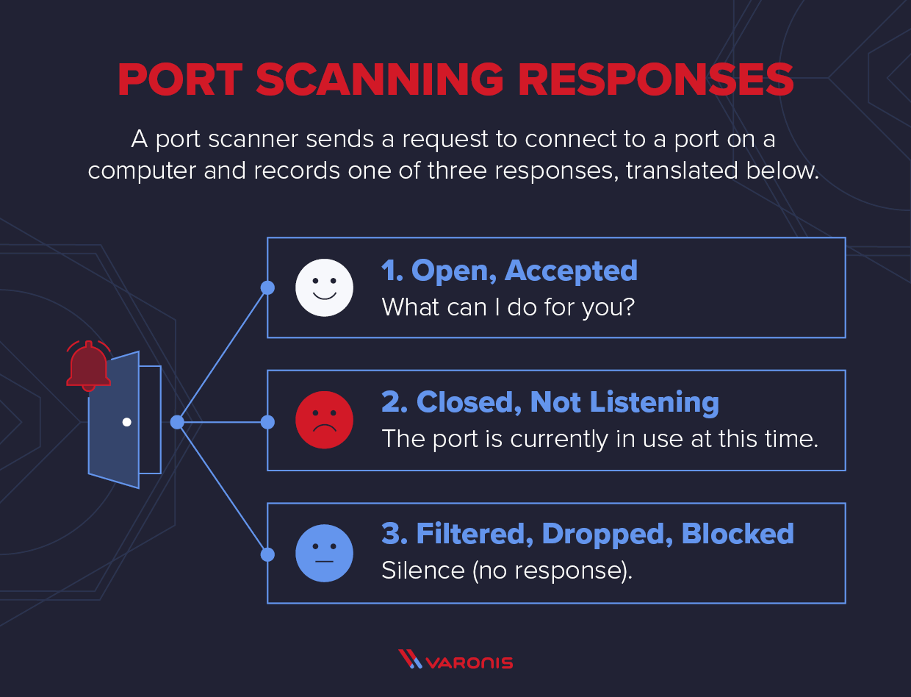

#  0. NULL scan: Hear secrets by pretending not to listen! 



Null scans send empty TCP packets to a target. Open ports might silently accept them, while closed ports may respond, giving attackers a clue. They’re stealthy.

Write a bash script that executes a TCP NULL scan on a host, targeting ports 20 to 25.

- Your script should accept host as an arguments $1.
Depending on the scanned network, the output could change. 
```
┌──(maroua)-[~/0x06_nmap_advanced_port_scans]
└─🏴 ./0-null_scan.sh www.holbertonschool.com
[sudo] password for maroua:
Starting Nmap 7.80 ( https://nmap.org ) at 2024-04-17 15:58 CET
Nmap scan report for www.holbertonschool.com (63.35.51.142)
Host is up (0.078s latency).
Other addresses for www.holbertonschool.com (not scanned): 34.249.200.254 52.17.119.105
rDNS record for 63.35.51.142: ec2-63-35-51-142.eu-west-1.compute.amazonaws.com

PORT   STATE         SERVICE
20/tcp open|filtered ftp-data
21/tcp open|filtered ftp
22/tcp open|filtered ssh
23/tcp open|filtered telnet
24/tcp open|filtered priv-mail
25/tcp open|filtered smtp

Nmap done: 1 IP address (1 host up) scanned in 2.54 seconds
```
---

#  1. FIN scans: like ghost-knocking on digital doors! 

A FIN scan is a network reconnaissance technique used to identify open ports on a target machine. It works by sending a TCP packet with only the FIN flag set, which typically signifies the end of a connection. By analyzing the target’s response, attackers can determine if a port is open, closed, or filtered by a firewall.

FIN scans are attractive because they can sometimes bypass basic firewalls and offer a stealthier approach compared to traditional methods.

Write a bash script that executes a FIN scan on a test network.The scan should identify potential stealth ports, focusing on ports 80 to 85.

- Your script should accept host as an arguments $1.
- Your script should use packet fragmentation to evade packet filters.
- Your script should Adjust the timing option to 2 to reduce scan detectability.
Depending on the scanned network, the output could change, this scan may require some time to finish.
```
┌──(maroua)-[~/0x06_nmap_advanced_port_scans]
└─🏴 ./1-fin_scan.sh www.holbertonschool.com
[sudo] password for maroua:
Starting Nmap 7.80 ( https://nmap.org ) at 2024-04-22 13:30 CET
Nmap scan report for www.holbertonschool.com (52.17.119.105)
Host is up (0.17s latency).
Other addresses for www.holbertonschool.com (not scanned): 63.35.51.142 34.249.200.254 64:ff9b::3411:7769 64:ff9b::22f9:c8fe 64:ff9b::3f23:338e
rDNS record for 52.17.119.105: ec2-52-17-119-105.eu-west-1.compute.amazonaws.com

PORT   STATE         SERVICE
80/tcp open|filtered http
81/tcp open|filtered hosts2-ns
82/tcp open|filtered xfer
83/tcp open|filtered mit-ml-dev
84/tcp open|filtered ctf
85/tcp open|filtered mit-ml-dev

Nmap done: 1 IP address (1 host up) scanned in 17.14 seconds
```
---

#  2. Xmas scans: turning network packets into holiday lights! 



An Xmas scan utilizes TCP packets flagged with FIN, PSH, and URG to stealthily detect open ports, leveraging its unique packet configuration to potentially bypass firewall detection.

This technique, named for its illuminated packet headers, primarily receives responses from closed ports, making it a subtle tool for network analysis.

Write a bash script that executes a xmas scan on a test network.The scan should identify potential stealth ports, focusing on ports 440 to 450.

- Your script should accept host as an arguments $1.
- Your script should only show open (or possibly open) ports.
- Your script should show all packets sent and received.
- Your script should display the reason each port is set to a specific state.
Depending on the scanned network, the output could change. 
```
┌──(maroua)-[~/0x06_nmap_advanced_port_scans]
└─🏴 ./2-xmas_scan.sh www.holbertonschool.com
[sudo] password for maroua:
Starting Nmap 7.80 ( https://nmap.org ) at 2024-04-18 15:54 CET
SENT (0.1584s) ICMP [10.5.202.26 > 52.17.119.105 Echo request (type=8/code=0) id=40212 seq=0] IP [ttl=56 id=56105 iplen=28 ]
SENT (0.1584s) TCP 10.5.202.26:57513 > 52.17.119.105:443 S ttl=49 id=2579 iplen=44  seq=1688269977 win=1024 
SENT (0.1584s) TCP 10.5.202.26:57513 > 52.17.119.105:80 A ttl=43 id=33442 iplen=40  seq=0 win=1024 
SENT (0.1584s) ICMP [10.5.202.26 > 52.17.119.105 Timestamp request (type=13/code=0) id=36086 seq=0 orig=0 recv=0 trans=0] IP [ttl=45 id=39982 iplen=40 ]
RCVD (0.2425s) TCP 52.17.119.105:443 > 10.5.202.26:57513 SA ttl=107 id=0 iplen=44  seq=960423197 win=62727 
NSOCK INFO [0.2810s] nsock_iod_new2(): nsock_iod_new (IOD #1)
NSOCK INFO [0.2810s] nsock_connect_udp(): UDP connection requested to 127.0.0.53:53 (IOD #1) EID 8
NSOCK INFO [0.2810s] nsock_read(): Read request from IOD #1 [127.0.0.53:53] (timeout: -1ms) EID 18
NSOCK INFO [0.2810s] nsock_write(): Write request for 44 bytes to IOD #1 EID 27 [127.0.0.53:53]
NSOCK INFO [0.2810s] nsock_trace_handler_callback(): Callback: CONNECT SUCCESS for EID 8 [127.0.0.53:53]
NSOCK INFO [0.2810s] nsock_trace_handler_callback(): Callback: WRITE SUCCESS for EID 27 [127.0.0.53:53]
NSOCK INFO [0.5500s] nsock_trace_handler_callback(): Callback: READ SUCCESS for EID 18 [127.0.0.53:53] (107 bytes)
NSOCK INFO [0.5500s] nsock_read(): Read request from IOD #1 [127.0.0.53:53] (timeout: -1ms) EID 34
NSOCK INFO [0.5500s] nsock_iod_delete(): nsock_iod_delete (IOD #1)

[...]

Nmap scan report for www.holbertonschool.com (52.17.119.105)
Host is up, received syn-ack ttl 107 (0.083s latency).
Other addresses for www.holbertonschool.com (not scanned): 34.249.200.254 63.35.51.142
rDNS record for 52.17.119.105: ec2-52-17-119-105.eu-west-1.compute.amazonaws.com

PORT    STATE         SERVICE       REASON
440/tcp open|filtered sgcp          no-response
441/tcp open|filtered decvms-sysmgt no-response
442/tcp open|filtered cvc_hostd     no-response
443/tcp open|filtered https         no-response
444/tcp open|filtered snpp          no-response
445/tcp open|filtered microsoft-ds  no-response
446/tcp open|filtered ddm-rdb       no-response
447/tcp open|filtered ddm-dfm       no-response
448/tcp open|filtered ddm-ssl       no-response
449/tcp open|filtered as-servermap  no-response
450/tcp open|filtered tserver       no-response

Nmap done: 1 IP address (1 host up) scanned in 3.17 seconds
```
---

#  3. Maimon scans: the silent knock of network probing! 

Maimon scans: like knocking on doors with a magic wand — some ignore you, some slam the door, but you walk away without a trace!

A Maimon scan sends TCP packets with both FIN and ACK flags set to determine port status on a target machine.

Write a bash script that executes a Maimon scan on a test network.The scan should identify potential stealth ports, focusing on scanning the following service ports: http, https, ftp, ssh, and telnet.

- Your script should accept host as an arguments $1.
- Your script should scan ports with high verbosity.
Depending on the scanned network, the output could change. 
```
┌──(maroua)-[~/0x06_nmap_advanced_port_scans]
└─🏴 ./3-maimon_scan.sh www.holbertonschool.com
[sudo] password for maroua:
Starting Nmap 7.80 ( https://nmap.org ) at 2024-04-22 13:43 CET
Warning: Hostname www.holbertonschool.com resolves to 6 IPs. Using 34.234.52.18.
Initiating Ping Scan at 13:43
Scanning www.holbertonschool.com (34.234.52.18) [4 ports]
Completed Ping Scan at 13:43, 0.20s elapsed (1 total hosts)
Initiating Parallel DNS resolution of 1 host. at 13:43
Completed Parallel DNS resolution of 1 host. at 13:43, 0.00s elapsed
Initiating Maimon Scan at 13:43
Scanning www.holbertonschool.com (34.234.52.18) [5 ports]
Completed Maimon Scan at 13:43, 2.95s elapsed (5 total ports)
Nmap scan report for www.holbertonschool.com (34.234.52.18)
Host is up, received syn-ack ttl 105 (0.17s latency).
Other addresses for www.holbertonschool.com (not scanned): 3.233.126.24 52.206.163.162 64:ff9b::3411:7769 64:ff9b::3f23:338e 64:ff9b::22f9:c8fe
rDNS record for 34.234.52.18: ec2-34-234-52-18.compute-1.amazonaws.com
Scanned at 2024-04-22 13:43:45 CET for 3s

PORT    STATE         SERVICE REASON
21/tcp  open|filtered ftp     no-response
22/tcp  open|filtered ssh     no-response
23/tcp  open|filtered telnet  no-response
80/tcp  open|filtered http    no-response
443/tcp open|filtered https   no-response

Read data files from: /usr/bin/../share/nmap
Nmap done: 1 IP address (1 host up) scanned in 5.96 seconds
           Raw packets sent: 15 (596B) | Rcvd: 2 (88B)
```
---

#  4. TCP ACK scans: When you knock on the firewall's door just to see who yells back! 

The TCP ACK scan is a network probing technique used primarily to determine the filtering rules of a firewall. By sending a packet with the ACK flag set to various ports, and observing whether the target responds with an RST packet, security professionals can infer whether ports are statefully inspected.

You are a network administrator responsible for verifying the firewall rules for a newly deployed section of your corporate network. Before deploying critical services, you want to ensure that the firewall is properly filtering unexpected external ACK packets, which should all be blocked or filtered to enhance security against potential reconnaissance activities by attackers.

Write a bash script that performs a TCP ACK scan on a specified test network. The scan should identify potential stealth ports, focusing on ports 80, 22, 25.

- Your script should accept host as an arguments $1.
- Your script should accept ports as an arguments $2.
- Your script should display the reason each port is set to a specific state.
- Your script should enforce a time limit of 1000 milliseconds for each host response.
Depending on the scanned network, the output could change. 
```
┌──(maroua)-[~/0x06_nmap_advanced_port_scans]
└─🏴 ./4-ask_scan.sh www.holbertonschool.com 80,22,25
[sudo] password for maroua:
Starting Nmap 7.80 ( https://nmap.org ) at 2024-04-19 13:28 CET
Nmap scan report for www.holbertonschool.com (52.17.119.105)
Host is up, received reset ttl 31 (0.17s latency).
Other addresses for www.holbertonschool.com (not scanned): 63.35.51.142 34.249.200.254 64:ff9b::3f23:338e 64:ff9b::3411:7769 64:ff9b::22f9:c8fe
rDNS record for 52.17.119.105: ec2-52-17-119-105.eu-west-1.compute.amazonaws.com

PORT   STATE      SERVICE REASON
22/tcp unfiltered ssh     reset ttl 20
25/tcp unfiltered smtp    reset ttl 18
80/tcp unfiltered http    reset ttl 27

Nmap done: 1 IP address (1 host up) scanned in 0.57 seconds
```
---

#  5. TCP Window Scan: Like checking a letter's fine print to see if you're invited! 



The TCP Window scan refines the technique used in ACK scans by analyzing the |TCP window size of RST packets returned from a target. If a port is open, the TCP window size in the RST packet is often non-zero, subtly indicating an active listening state, whereas closed ports generally return a zero window size.

This method is useful when more common scans like SYN are blocked, offering an alternative for deducing port status.

Write a bash script that performs a a TCP Window scan on a specified test network. The scan should identify potential stealth ports, in the range from 20 to 30, but exclude ports from 25to 28.

- Your script should accept host as an arguments $1.
- Your script should accept ports as an arguments $2.
- Your script should accept a range of ports to exclude as an argument $3.
Depending on the scanned network, the output could change. 
```
┌──(maroua)-[~/0x06_nmap_advanced_port_scans]
└─🏴 ./5-window_scan.sh www.holbertonschool.com 20-30 25-28
[sudo] password for maroua:
Starting Nmap 7.80 ( https://nmap.org ) at 2024-04-19 15:38 CET
Nmap scan report for www.holbertonschool.com (3.233.126.24)
Host is up (0.22s latency).
Other addresses for www.holbertonschool.com (not scanned): 34.234.52.18 52.206.163.162 64:ff9b::22f9:c8fe 64:ff9b::3f23:338e 64:ff9b::3411:7769
rDNS record for 3.233.126.24: ec2-3-233-126-24.compute-1.amazonaws.com

PORT   STATE SERVICE
20/tcp open  ftp-data
21/tcp open  ftp
22/tcp open  ssh
23/tcp open  telnet
24/tcp open  priv-mail
29/tcp open  msg-icp
30/tcp open  unknown

Nmap done: 1 IP address (1 host up) scanned in 0.86 seconds
```
---

#  6. Custom Scan: Because even network security likes its coffee made a certain way! 

A Custom Scan is a targeted method used in network security to evaluate specific vulnerabilities or areas within a network. It enables cybersecurity experts to focus on particular segments, ports, or protocols, optimizing resources and identifying critical weaknesses more effectively.

The security team decides to use an advanced Nmap scan that manipulates TCP flags to create non-standard packets, which are typically not used in regular communications but might be utilized by attackers to probe and exploit vulnerabilities in network defenses.

Write a bash script that executes a custom scan. The script should configure Nmap to send packets with all possible TCP flags set, targeting ports 80 to 90 on a specified host.

- Your script should accept host as an arguments $1.
- Your script should accept ports as an arguments $2.
- Your script should save the output to the file custom_scan.txt.
- Your script should redirect both error messages and standard output to ensure nothing appears on the screen.
Depending on the scanned network, the output could change. 
```
┌──(maroua)-[~/0x06_nmap_advanced_port_scans]
└─🏴 ./6-custom_scan.sh www.holbertonschool.com 80-90
[sudo] password for maroua:
┌──(maroua)-[~/0x06_nmap_advanced_port_scans]
└─🏴 cat custom_scan.txt
# Nmap 7.80 scan initiated Fri Apr 19 19:30:06 2024 as: nmap -scanflags URGACKPSHRSTSYNFIN -p 80-90 -oN custom.txt www.holbertonschool.com
Nmap scan report for www.holbertonschool.com (3.233.126.24)
Host is up (0.16s latency).
Other addresses for www.holbertonschool.com (not scanned): 34.234.52.18 52.206.163.162 64:ff9b::34ce:a3a2 64:ff9b::22ea:3412 64:ff9b::3e9:7e18
rDNS record for 3.233.126.24: ec2-3-233-126-24.compute-1.amazonaws.com

PORT   STATE    SERVICE
80/tcp filtered http
81/tcp filtered hosts2-ns
82/tcp filtered xfer
83/tcp filtered mit-ml-dev
84/tcp filtered ctf
85/tcp filtered mit-ml-dev
86/tcp filtered mfcobol
87/tcp filtered priv-term-l
88/tcp filtered kerberos-sec
89/tcp filtered su-mit-tg
90/tcp filtered dnsix

# Nmap done at Fri Apr 19 19:30:10 2024 -- 1 IP address (1 host up) scanned in 4.55 seconds
```

