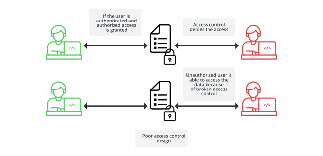

#  0. (A1:2021) - Broken Access Control 



Creating your own session IDs?, Make sure they’re as unpredictable as a plot twist in a mystery novel. If they’re too simple, it’s like leaving the keys in the ignition for hackers. Complexity and randomness are your locks and alarms.

For this task, tamper the hijack_session cookie to sneak into someone else’s session.

- Target machine: Cyber - WebSec 0x01
- Target Url: http://web0x01.hbtn/a1/hijack_session

hints: you get new cookie each time you visit the target url using fresh session, just figure the pattren..
---

#  1. (A2:2021) - Cryptographic Failures - Scripting 


Create a Bash script that decode XOR WebSphere. Your Script should:

- Accept the Hash args: $1.
- Match the following output.
```
┌──(yosri㉿hbtn-lab)-[~/…/web_application_security/0x1_owasp_top_10]
└─$ ./1-xor_decoder.sh {xor}KzosKw==
test
```
---

#  2. (A2:2021) - Cryptographic Failures - Catch The Flag 

**For this task:**

- Turn back to the target machine cyber_websec_0x01,
- Heads out to: A2 - Cryptographic Failures -> Encoding Failure.

Your goal is finding out the the login credentials in order to retreive the flag on sign in.

- Login Page : http://[MACHINE-IP]/a2/crypto_encoding_failure/

**Where to start ?** (Hints)

- Profile Page : /a2/crypto_encoding_failure/profile

hints:

- Think about the headers of all Fetch/XHR made requests.
- Use the previous task to decrypt the password.

---

#  3. (A3:2021) - Injection [Stored XSS] - part 1/3 


This set of tasks is designed to mimic the famous Samy worm, which propagated across MySpace in 2005 by exploiting Cross-Site Scripting (XSS) vulnerabilities.

**Identifying Profiles to Follow**

Your first task is to identify three specific profiles within our web application that you need to follow. These profiles are crucial for the next steps of this exercise.

Instructions:

- 1. Navigate and Capture Requests:
	- Begin by exploring the web application, paying close attention to the network requests and responses.
	- You can use browser developer tools (F12) to monitor these interactions.
- 2. Identify Profile IDs:
	- Look for requests that return user information.
	- Within these responses, identify three specific profile IDs that you are instructed to follow.
- 3. Follow the Profiles:
	- Once you have identified the profile IDs, navigate to each profile: http://[MACHINE-IP]/a3/xss_stored/profile/[PROFILE-ID].
	- Follow each profile by clicking on the heart icon or the designated follow button on their profile page.
- 4. Catch the Flag:
	- Go back to your profile to find your waiting Flag ⛳️.

---

#  4. (A3:2021) - Injection [Stored XSS] - part 2/3 

Discovering a Vulnerable Input Field

Identify which input field in the profile edit page is vulnerable to Cross-Site Scripting (XSS).

Instructions:

- 1. Explore Edit Profile Page:
	- Navigate to your profile’s edit page: http://[MACHINE-IP]/a3/xss_stored/edit.
	- This page contains multiple input fields where you can enter or update your personal information.
- 2. Test for XSS Vulnerability:
	- Test each input field for XSS vulnerability by entering a simple script such as <script>alert('XSS')</script> into the field and saving your changes.
	- Observe which input field, when modified, triggers the JavaScript alert upon viewing your profile. This indicates an XSS vulnerability.
- 3. Submit the vuln case name:
	- Observe the source code behavior. Quotes..
	- Find out the vuln field name.
```
$ echo "name" > 4-vuln.txt
```

