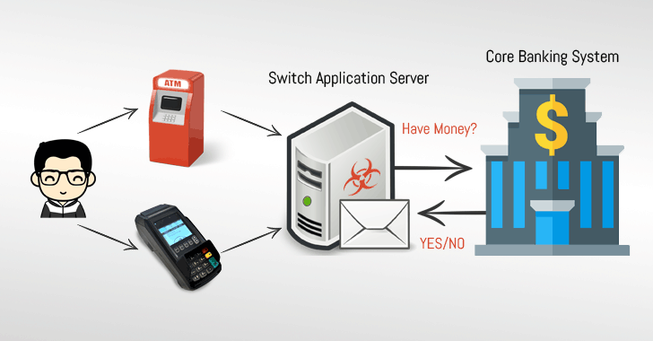

#  0. Uncovering User IDs 



**Warmning up..**
Welcome to the first step in your journey through the realm of Insecure Direct Object References (IDOR), set against the backdrop of a carefully crafted banking application.
Your mission begins with the foundational element of many IDOR vulnerabilities: discovering other users’ IDs.

Understanding how user IDs are structured, assigned, and exposed can provide you with the initial foothold required to explore deeper vulnerabilities within the application.
Let’s dive in.

- Target Application: CyberBank
- Initial Endpoint: http://web0x06.hbtn/dashboard
```
Useful instructions:
1. Log into CyberBank using provided credentials and start exploring features, paying close attention to any mention or use of user IDs.
2. Observe the URL structure, page content, and any API requests for patterns in how user IDs are displayed or transmitted.
3. Investigate other areas of the application where user-specific actions occur (e.g., transaction history, settings) for additional exposure of user IDs.
4. Experiment with altering user ID values in URLs or requests to access information pertaining to other users.
5. Within the info of a target user, identify and note down a unique flag as proof of successfully uncovering user IDs.
```
---

#  1. Enumerating Account Numbers for Balance Disclosure 

Having successfully identified user IDs in the previous task, your next challenge in the CyberBank environment is focused on account numbers.

Specifically, you will leverage the user IDs obtained to enumerate account numbers and subsequently disclose account balances.
This stage underscores the potential depth of IDOR vulnerabilities in financial applications.

- Target Application: CyberBank
- Relevant Endpoint: http://web0x06.hbtn/dashboard
```
Useful instructions:
1. Utilize the user ID(s) discovered in Task 1 to explore areas of the application where user account numbers might be displayed or referenced.
2. Pay attention to transaction history, fund transfer features, or profile/account settings that might reveal account numbers associated with the user IDs.
3. Once you have an account number, craft a request to the `/accounts/` API  endpoint, incorporating the account number to retrieve the balance information.
4. Experiment with modifying request parameters or paths using different account numbers to assess the application's response and to check for unauthorized access to account balances.
5. In the account balance information of a target account, look for a unique flag as evidence of successful enumeration and access.
```
---

#  2. Manipulating Wire Transfers to Inflate Account Balance 

After uncovering user IDs and account numbers, leading to the disclosure of account balances, your journey through the CyberBank simulation progresses to exploiting wire transfer functionalities.
This task demands a keen understanding of how the application processes transactions.
You’re tasked with manipulating wire transfer requests to artificially inflate your account balance beyond $ 10K.
Achieving this milestone will trigger a unique Flag ⛳️ as proof of your advanced exploitation capabilities.

- Target Application: CyberBank
- Wire Transfer Endpoint: http://web0x06.hbtn/dashboard
```
Useful instructions:
1. Review the functionality of the wire transfer feature within CyberBank, taking note of how transactions are initiated, especially the parameters required (e.g., source account, destination account, amount).
2. Begin with smaller transactions to understand the application's validation checks and response behaviors, such as how it handles negative amounts or transfers between accounts you control.
3. Incrementally adjust the transaction amount, or experiment with other parameters like source and destination accounts, to identify any possible oversight in the transaction processing logic.
4. Your goal is to perform valid transactions that cumulatively increase your account balance over 10k. Pay attention to transaction limits, rate limiting, or other security controls that might prevent rapid or large transactions.
5. Once your balance exceeds 10k, observe the application's response for the appearance of a `Flag`, indicating successful exploitation of the wire transfer functionality.

Remember:
- Your actions within this simulation are for educational purposes. Applying these techniques in real-world scenarios without authorization is illegal and unethical.
```
---

#  3. Bypassing 3D Secure Verification for Unauthorized Payment 

In this culminating interactive challenge within the CyberBank simulation,
you’re tasked with executing a payment transaction using another account holder’s details while cleverly diverting the 3D Secure verification to your account.
This advanced task simulates an attack vector targeting the payment authorization process, specifically the 3D Secure verification mechanism designed to add an extra layer of security for online credit and debit card transactions.
This tasks sound crazy I know, just take your time with a deep breath.
To understand the logic behind the payment flow, try a normal payment with your account information.

- Target Application: CyberBank
- Payment Endpoint: http://web0x06.hbtn/upgrade
- OTP Confirmation Endpoint http://web0x06.hbtn/confirmation
```
Useful instructions:
1. Initiate a payment transaction on the `/upgrade` page using the account details of another holder but ensure the transaction amount is within legitimate bounds to avoid immediate flags by fraud detection systems.
2. When redirected to the 3D Secure verification page (`/cards/3dsecure/`), carefully observe the request made when submitting the OTP (One-Time Password).
3. Intercept and modify this OTP submission request in a way that the verification appears to be from your account, but ensure the charge is still made to the other account holder's account.
4. Consider manipulating parameters within the request, such as session identifiers or account numbers, to redirect the verification process successfully.
5. Achieving successful verification under these altered conditions will trigger a transaction completion message along with a unique `Flag` as evidence of exploiting the 3D Secure process.

Remember:
- This simulation is designed to enhance your understanding of financial web application vulnerabilities and should only be applied in ethical, authorized testing environments.
```
---

#  4. Crafting a Comprehensive Vulnerability Report 

After navigating the complexities of IDOR vulnerabilities within the CyberBank simulation, your final task is to compile and present your findings in a detailed vulnerability report.
This report should not only recount the vulnerabilities you’ve directly encountered during the project tasks but also include any additional security flaws discovered through your exploration.
The goal is to create a document that could realistically be presented to a financial institution to help them understand and remediate the identified vulnerabilities.

## Report Guidelines:

Your report should be structured and detailed, adhering to professional standards. Consider using a Google Doc for its collaborative features and accessibility. Here are key elements to include:

- **1. Introduction:** Provide a brief overview of the CyberBank application and the purpose of your security assessment.

- **2. Methodology:** Describe the methods and tools used during your exploration, including Burp Suite functionalities employed to discover and exploit the vulnerabilities.

- **3. Vulnerability Details:**
	- For each vulnerability identified, include:
		- A description of the flaw.
		- The potential impact on the application and its users.
		- Step-by-step reproduction steps.
		- Supporting evidence (screenshots, code snippets, request/response pairs).

- **4. Additional Findings:** Detail any other security issues discovered outside of the structured tasks, following the same format as above.

- **5. Recommendations:** Provide specific, actionable recommendations for each vulnerability to guide the CyberBank’s development team in addressing the issues.

- **6. Conclusion:** Summarize your findings and reinforce the importance of addressing these vulnerabilities to protect the application and its users.

- **7. References:** Include any external resources, tools, or documentation that supported your assessment.

## Submission Instructions:

1. Create your report in Google Docs, ensuring it is well-organized and follows the guidelines provided.
2. Make sure to anonymize any sensitive information.
3. Upon completion, adjust the sharing settings to ‘Anyone with the link can view.’
4. Submit the link to your report as part of your project completion.

